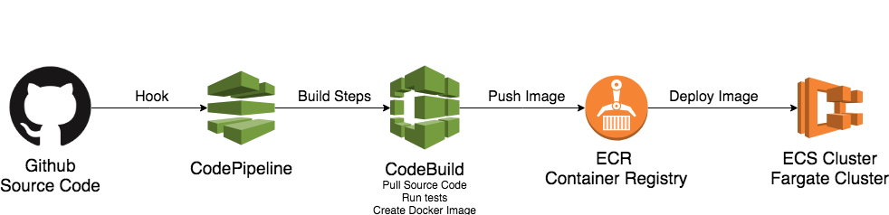

## Arquitetura


## Deploy Pipeline




* Prefire criar um suite completa para fazer que vai:
- Criar um Pepiline para build da imagem com o CodePipeline/CodeBuild
- Subir a imagem para o ECR
- Fazer o deploy no ECS

As opções do conteiner e também pode ser editado no arquivo:

```
modules/ecs/task-definitions/api-task.json
```
Aqui também foi setado a variavel de ambiente ELO_PASS

## Edite o arquivo de variaveis

Caso queria trocar alguma variavel, edite o arquivo `variables.tf`

## How to Deploy

### 1) Github Access Token
* Crie o  Github Access Token. [Siga o passo a passo:](https://help.github.com/articles/creating-a-personal-access-token-for-the-command-line/).

* Export Github Token como variavel de ambiente.

```bash
export GITHUB_TOKEN=YOUR_TOKEN
```

#### 2) Terraform
* Entre do diretorio Terraform:

```bash
cd terraform
```

* Rode o script `./run_terraform.sh`. Ele vai baixar o terraform na versão correta.

* Rode o comando para iniciar o Terraform

```bash
./terraform init
```

* Rode o terraform plan

```bash
./terraform plan -out=plan001
```

* Aplique as configuração na AWS:

```bash
./terraform apply plan001a
```
